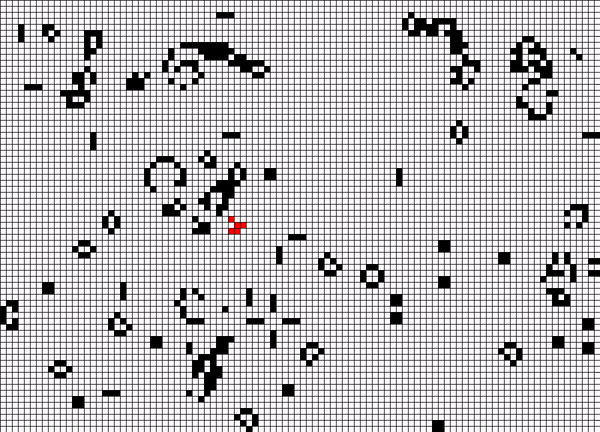

# Conway's Organisms

This is a program to track Organisms in [Conway's Game of Life](https://en.wikipedia.org/wiki/Conway%27s_Game_of_Life) as they emerge in (pseudo) random state initializations.



## Usage

You can define patterns of organisms and each of their phases with `specify_organism_pattern.py` python script.

```shell
$ python specify_organism_pattern.py
```

Inputted pattern for glider:

```
Input phase dimensions (Ex. 3 3): 3 3
Input each row of the organism pattern using 0 and 1 (with no delimiters): 
001
101
011

Inputed pattern: 
□□■
■□■
□■■
Do you want to input another phase? (Y/n)
```

You can also specify a seed for pseudo-random initialization (-1 for random initialization).

```java
int Random_Seed = 42;
```

## Additional Notes

The `specify_organism_pattern.py` script will replace the `Patterns.pde` file with specified organism's patterns. The provided `Patterns.pde` file in this repository contains the patterns for glider.